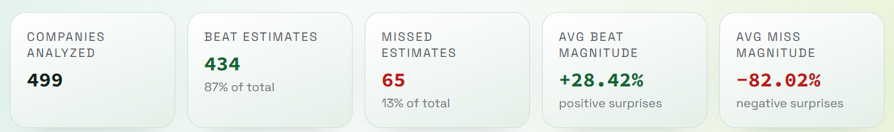
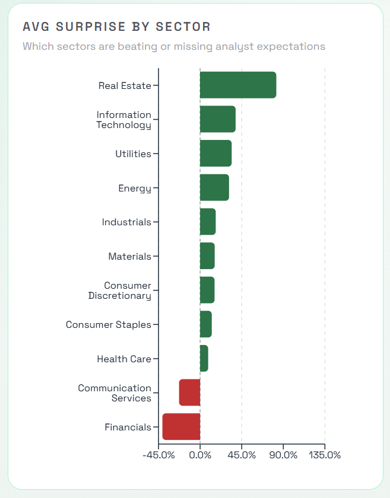
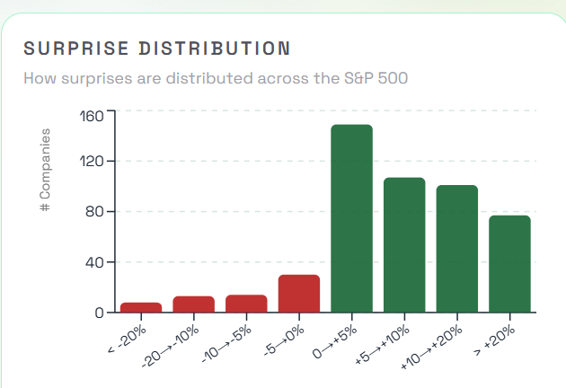
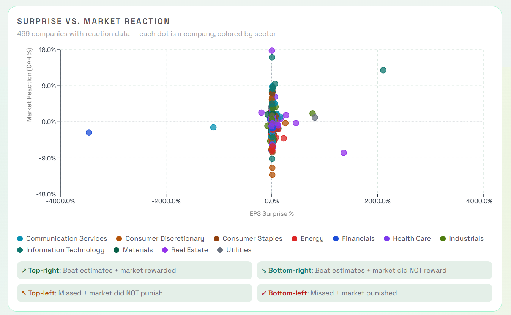
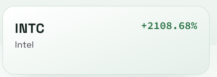
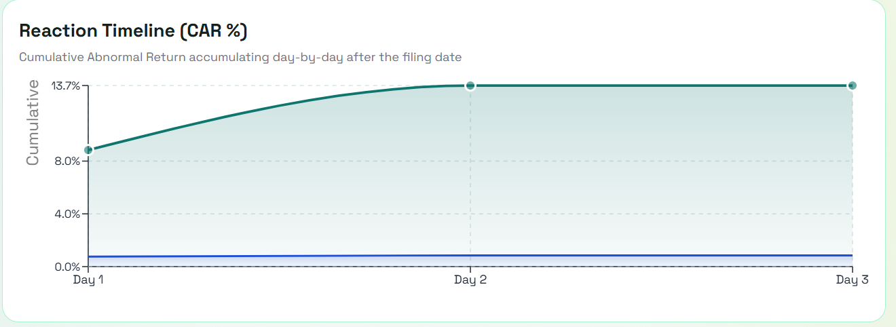
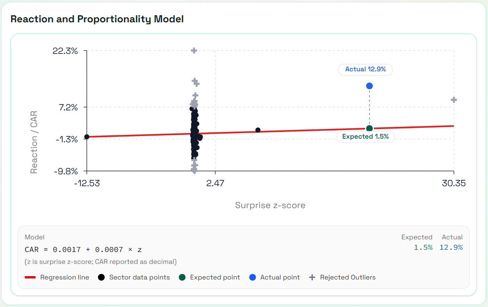
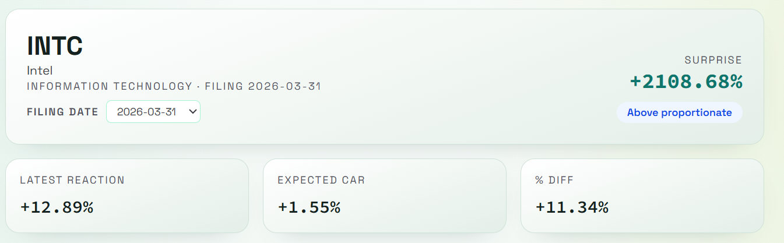
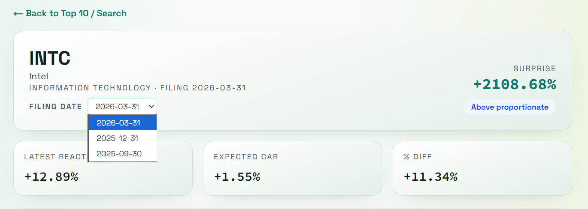

## Page 1 — S&P 500 Dashboard

### Visual 1 — Summary Stats Banner

A five-cell KPI ribbon that appears at the top of the dashboard. Each cell is a card rendered in a responsive CSS grid (`2 cols → 3 cols → 5 cols`).




| Field | Colour Logic |
| --- | --- |
| Companies Analyzed | Neutral — `text-foreground` |
| Beat Estimates | Green — `text-positive` |
| Missed Estimates | Red — `text-negative` |
| Avg Beat Magnitude | Green — `text-positive` |
| Avg Miss Magnitude | Red — `text-negative` |

---

### Visual 2 — Sector Surprise Bar Chart

A **horizontal bar chart** showing average EPS surprise per GICS sector, sorted by magnitude. Clicking a bar filters every other chart on the page to that sector.



| Feature | Detail |
| --- | --- |
| Bar colour | Green (`#166534`) for beats · Red (`#b91c1c`) for misses |
| Selected state | Active sector: full opacity + emerald border · Others: 22% opacity |
| Reference line | Dashed vertical line at x = 0 |
| Tooltip | Shows sector name, avg surprise %, company count |
| Interaction | `onClick` → filters dashboard to that sector |

---

### Visual 3 — Surprise Histogram

A **vertical bar chart** showing the distribution of all S&P 500 EPS surprises across 8 fixed buckets. Clicking a bucket filters the card list below.



| Bucket range | Bar colour |
| --- | --- |
| Negative buckets (`< 0%`) | Red `#b91c1c` |
| Positive buckets (`≥ 0%`) | Green `#166534` |

| Feature | Detail |
| --- | --- |
| Buckets | 8 fixed ranges: `< −20%` through `> +20%` |
| Selected state | Active bucket: full opacity + border · Others: 22% opacity |
| X-axis labels | Angled −35° to avoid overlap |
| Tooltip | Shows bucket label + count with `company` / `companies` pluralisation |
| Interaction | `onClick` → filters the card list to that surprise range |

---

### Visual 4 — Surprise vs. Reaction Scatter Chart

A **scatter chart** plotting every S&P 500 ticker — EPS surprise % on the X-axis against 3-day CAR % on the Y-axis. Each dot is colour-coded by GICS sector.



| Feature | Detail |
| --- | --- |
| Sector colours | 11 unique colours; `SECTOR_COLORS` map keyed by GICS sector name |
| Reference lines | Dashed grey lines at x = 0 and y = 0, forming four quadrants |
| Custom dot | Each dot rendered as `<circle>` with sector colour fill |
| Tooltip | Shows ticker, company name, sector (in sector colour), surprise %, CAR % |

---

### Visual 5 — Surprise Card

Each company in the filtered list is rendered as a clickable card. Clicking navigates to the ticker detail page with filing date and sector pre-filled in the URL.



---

## Page 2 — Ticker Detail Page

### Visual 6 — Reaction Timeline Area Chart

A **dual-area chart** showing cumulative returns over the 1–3 trading days after an earnings filing. Two shaded areas are drawn on the same axes — the ticker's total return and the SPY market return — so the gap between them is the visible CAR.



| Element | Style |
| --- | --- |
| Ticker area | Teal stroke `#0f766e` · Gradient fill 35% → 5% opacity |
| SPY area | Blue stroke `#1d4ed8` · Gradient fill 32% → 6% opacity |
| Ticker dots | Filled circle r=5, white stroke; active r=7 |
| Reference line | Dashed grey at y = 0 |
| Tooltip | Shows date, cumulative ticker returns, cumulative market returns, cumulated actual reaction (coloured by sign) |

---

### Visual 7 — Regression Scatter Chart

A **composed chart** showing the sector's linear regression model. All (surprise z-score, CAR) data points for the sector are plotted; the fitted regression line is drawn through them. Two highlighted reference dots show where this specific ticker sits — expected CAR (dark green) and actual CAR (blue).



#### Combined Proportionality Reaction Chart

A **composed chart** that overlays the regression line with two labelled `ReferenceDot` markers — one for expected CAR and one for actual CAR — with floating pill-style labels showing the percentage values.

| Element | Style |
| --- | --- |
| Regression line | Red `#dc2626`, strokeWidth 3 |
| Expected CAR dot | Dark green `#065f46`, r=7, pill label above/below |
| Actual CAR dot | Blue `#2563eb`, r=7, pill label above/below |
| Pill labels | White rect with rounded corners, coloured text, positioned above or below dot depending on which is higher |
| X domain | Auto-centred around ticker's z-score ± configurable half-range |

| Element | Style | Purpose |
| --- | --- | --- |
| Regression line | Red `#dc2626`, 40-point polyline | Sector expected-CAR model |
| Sector data points | Black dots | All (z-score, CAR) pairs used to fit the model |
| IQR outlier points | Grey / dimmed | Excluded from fit, shown for transparency |
| Expected CAR dot | Dark green `#065f46`, r=7, white ring | Where sector model predicts this ticker's CAR |
| Actual CAR dot | Blue `#2563eb`, r=7, white ring | What the market actually did |
| Hover interaction | `activePoint` state toggles tooltip card | Inspect expected vs. actual values |

---

## Supporting Visual Elements

### Visual 8 — Proportionality Gauge

A minimal metric card displaying the proportionality deviation value


---

## Interactive Filtering System

The dashboard charts are wired together — clicking one visual filters all others:

```
                    ┌────────────────────────────────┐
  Click sector bar  │  selectedSector state          │  → fades non-matching cards
  ────────────────► │  in page.tsx                   │  → dims other sector bars
                    └────────────────────────────────┘

                    ┌────────────────────────────────┐
  Click histogram   │  selectedBucket state          │  → filters card list to
  bucket ─────────► │  in page.tsx                   │     that surprise range
                    └────────────────────────────────┘

                    ┌────────────────────────────────┐
  Type in search    │  Fuse.js fuzzy search          │  → matches ticker symbols
  box ────────────► │  over selectedItems            │     and company names
                    └────────────────────────────────┘
```

Sector filter and histogram filter compose: both can be active simultaneously, narrowing the visible card list to companies that satisfy both conditions.

---

## Filing Date Selector (Ticker Detail)

A dropdown on the ticker detail page lets the user switch between earnings seasons without a full page reload. Changing the selection updates the URL and re-fires all three data fetches in parallel.



---

## Component Inventory

| # | Component | Type | Chart Library | Page |
| --- | --- | --- | --- | --- |
| 1 | `summary-stats-banner.tsx` | KPI cards | None | Dashboard |
| 2 | `sector-surprise-chart.tsx` | Horizontal bar | Recharts `BarChart` | Dashboard |
| 3 | `surprise-histogram.tsx` | Vertical bar | Recharts `BarChart` | Dashboard |
| 4 | `surprise-reaction-scatter.tsx` | Scatter | Recharts `ScatterChart` | Dashboard |
| 5 | `surprise-card.tsx` | Card / link | None | Dashboard |
| 6 | `reaction-timeline-chart.tsx` | Dual area | Recharts `AreaChart` | Ticker Detail |
| 7 | `regression-chart.tsx` | Composed scatter + line | Recharts `ComposedChart` | Ticker Detail |
| 8 | `combined-proportionality-reaction-chart.tsx` | Composed line + dots | Recharts `ComposedChart` | Ticker Detail |
| 9 | `proportionality-gauge.tsx` | Metric display | None | Ticker Detail |
| 10 | `loading-spinner.tsx` + inline skeletons | Skeleton loader | None | Both |
| 11 | `section-nav.tsx` | Sticky nav | None | Both |

---
